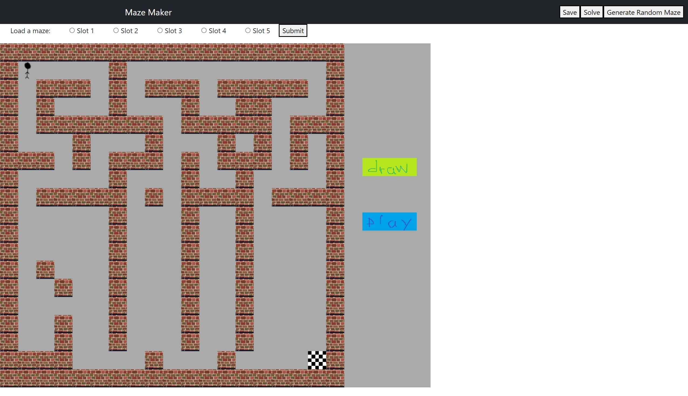
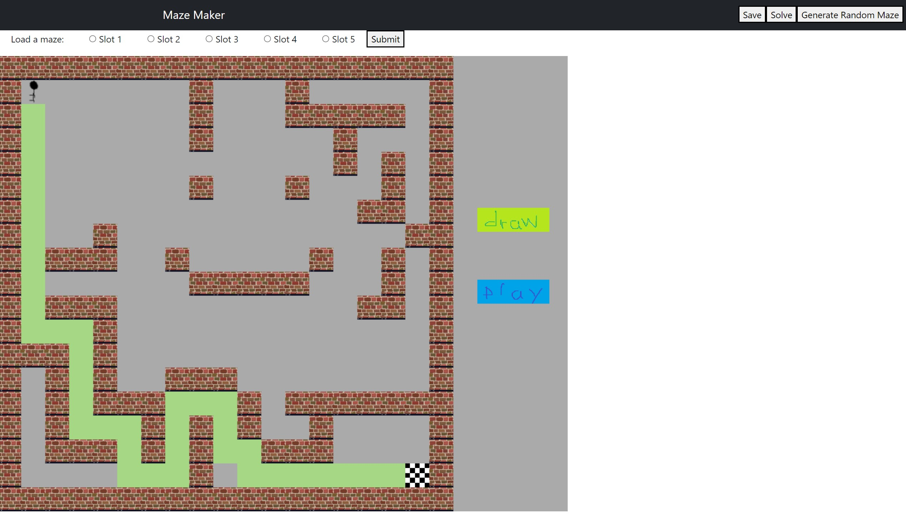

Maze Maker
---

### Summary 
Maze Maker is a browser game where players can create and play on their own mazes. Maze Maker also comes with a instant-solve feature, the ability to randomly generate a maze, as well as saving and loading previously created mazes.

### Technical Details
Maze Maker's backend was created using a MySQL database, npm, and ExpressJS. The frontend was built using Javascript and PixiJS. The maze solving algorithm is a naive algorithm.

### Setup
Things needed to install:
1. Run `npm install` in the project folder
2. Install `xampp` from https://www.apachefriends.org/index.html
3. Open the `xampp` controller and start the `MySQL` and `Apache` services
4. Run using `node app.js`. The app is run on port 5000.

### Screenshots
Home screen with the maze editor (showing a randomly generated maze):  
  

Maze solving algorithm on a custom maze:  

